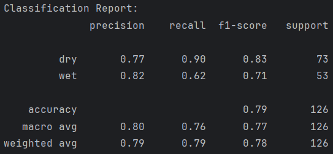
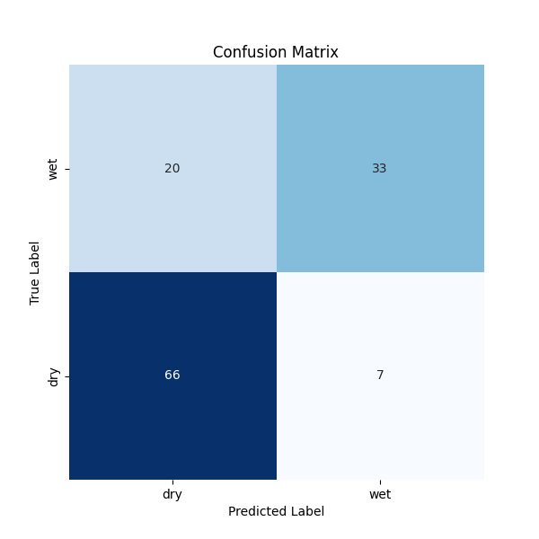
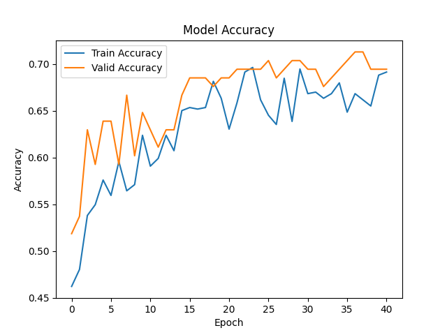
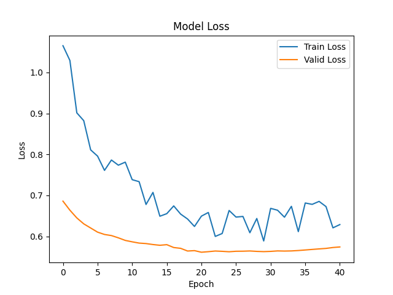

# Drought-and-Irrigation-Analysis
This project focuses on soil moisture classification using deep learning and computer vision techniques.
The goal is to support irrigation decisions by analyzing soil and plant conditions from images.

## Project Overview
Developed a CNN model with transfer learning (DenseNet121).
Applied data augmentation to improve generalization, with extra emphasis on the minority class.
Used class weights to balance class distribution during training.
Created a custom test set for more reliable evaluation.

## Tech Stack
- Python 3.13
- TensorFlow / Keras
- scikit-learn
- OpenCV
- Matplotlib/Seaborn

## Dataset
- Dataset Source: Soil Moisture Classification Dataset by Chanakya Project
- https://universe.roboflow.com/chanakya-project/soil-moisture/dataset/4
- Images are split into train, validation, and test sets.
- Single-time data augmentation is applied to expand training samples.

## Model Architecture
- Base Model: DenseNet121
- Global Average Pooling
- Dense layers with Dropout for regularization

## Requirements
- Python 3.13
- TensorFlow / Keras
- scikit-learn
- matplotlib, seaborn
- numpy, requests, zipfile, shutil

## Installation
1. Clone the repository:
   ```bash
   git clone https://github.com/alt4ble/Drought-and-Irrigation-Analysis.git
   cd Drought-and-Irrigation-Analysis

3. Install dependencies:
   ```bash
   pip install -r requirements.txt

4. Train the Model:
   ```bash
   python train.py

5. Evaluate:
   ```bash
   python evaluate.py

## Usage
Run the training script:

   ```python scripts/training.py```

The script will:
- Download the dataset if not present
- Split the dataset into train/valid/test
- Perform single-time augmentation
- Train a DenseNet121 model
- Save the final model as final_model.keras

## Results
- Accuracy: %79

- Classification Report:



- Confusion Matrix:



- Test Accuracy & Loss Graphs:



